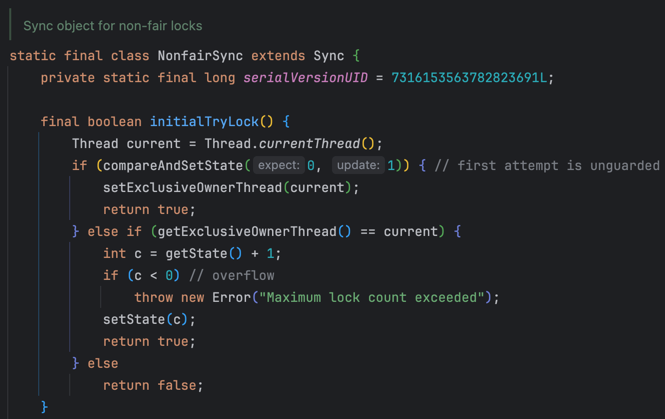
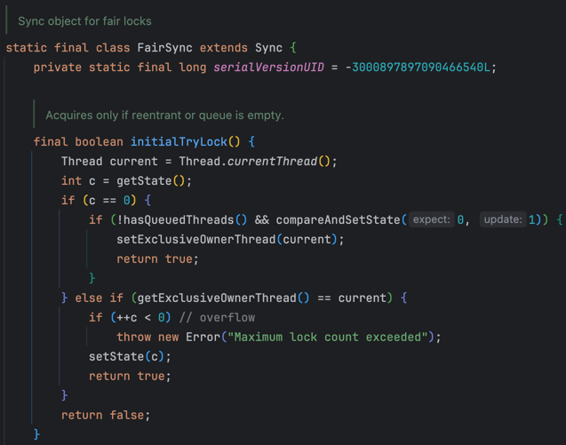
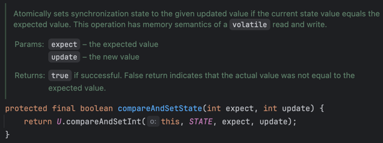
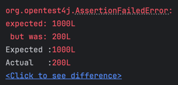
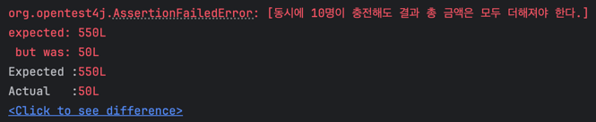
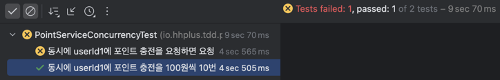
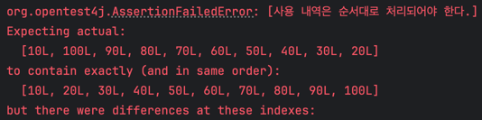
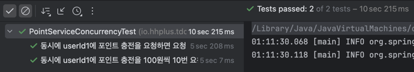
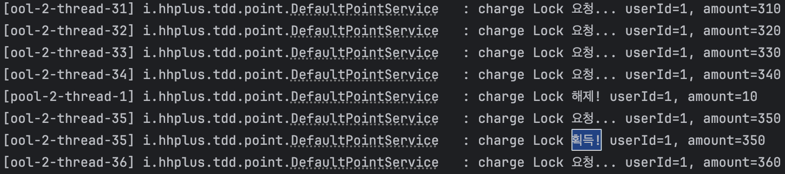

# 동시성 제어 방식에 대한 분석

## 1. 동시성 문제란?

동시성 문제는 concurrent하게 동작하는 여러 task가 동시에 공유자원을 접근할 때 발생합니다. 

예를 들어, 공유자원 int count = 0이 있고, 스레드 A와 스레드 B가 각각 count에 10을 더하는 작업을 수행한다고 가정해보겠습니다.

```java
public class Counter {
    private int counter = 0;

    public void increment() {
        counter = counter + 10;
    }
}
```

스레드 A와 스레드 B가 increment()를 호출하면, 각각 +10씩 이루어지기 때문에 +20을 기대합니다.
그러나 만약 스레드 A와 스레드 B가 동시에 increment()를 호출해서 읽은 counter의 값이 모두 0이라면, 결과가 +10이 됩니다.
즉, 멀티스레드 환경에서 기대하는 결과가 나오지 않는 것이 동시성 문제입니다.

## 2. 동시성 제어 방식

동시성 제어란, 멀티스레드 환경에서도 원하는(기대하는) 결과를 보장하는 것을 의미합니다. 
그러면 동시성 제어 방식에 어떤 것들이 있는지 살펴보겠습니다.

### 2.1 synchronized

synchronized는 블록, 메소드, 클래스 단위로 동기화를 적용할 수 있습니다. 특정 코드 블록 -> 인스턴스 메소드 -> 정적 메소드 수준으로 점차 범위가 증가합니다.

```java
// 1. 코드 블록 동기화 (블록 수준)
public void increment() {
    // logic 1...
	synchronized (this) {
  		counter++;
  	}
  	// logic 2...
}
  
// 2. 메서드 동기화 (메소드 수준)
private int counter = 0;
public synchronized void increment() {
	counter++;
}
  
// 3. 정적 메서드 동기화 (클래스 수준)
private static int counter = 0;
public static synchronized void increment() {
	counter++;
}
```

synchronized는 블록 전체에 락(Monitor Lock)을 걸고 다른 스레드가 접근하면 blocking되는 방식이므로, 스레드가 많을 수록 **성능이 크게 떨어집니다.**
1,000개의 스레드가 동시에 실행되다가 synchronized 블록에 진입하면, 999개의 스레드는 대기하게 되는 거니까요.

### 2.2 ReentrantLock

Lock 인터페이스 구현체 중 하나로 코드 상으로 유연하게 Lock을 사용할 수 있습니다.
AbstractQueuedSynchronizer(AQS)로 구현되어 있고, ReentrantLock의 fairness 여부에 따라 "Fair mode"과 "NonFair mode"으로 나뉩니다.

- AQS란?
  - FIFO 대기 큐를 통해 스레드가 큐에서 대기하고, state 값을 통해 락을 획득한 횟수를 나타냅니다.
    - 대기 큐: CLH Node (이중 연결 리스트)
  - CountDownLatch, ReentrantLock, Semaphore 들이 모두 AQS를 기반으로 구현되어 있습니다.
  - 각 동기화 방식에 맞게 AQS를 상속받아 구현되어 있습니다. 
  - ReentrantLock에서는 state가 1 이상이면, 나머지는 모두 대기합니다. (단, 하나의 스레드가 락을 획득한 상태)
  - Semaphore에서는 state가 일정 임계값 S 이상이면, 나머지는 모두 대기합니다. (S개의 스레드가 락을 획득한 상태)

- ReentrantLock의 fairness에 따른 차이
  - NonFairSync
    - 락이 비어있으면서 내가 가장 먼저 접근했다면 락을 획득합니다.
    - `compareAndSetState(0, 1)`: CAS 알고리즘
    - 
  - FairSync:
    - 대기 스레드가 없고, 락이 비어있으면서 내가 가장 먼저 접근했다면 락을 획득합니다.
    - `!hasQueuedThreads() && compareAndSetState(0, 1)`
    - 


#### CAS 알고리즘이란?
Compare And Swap의 약자로, 기존 값과 변경할 값을 compare해서 같으면 swap하고, 아니면 다시 시도하는 방식입니다.
- expect: 기존 값 (0) / update: 변경할 값 (1)
- state를 0 -> 1로 변경하려고 하는데, (락을 획득하려는 시도)
- 이때, expect와 state가 같으면 true를 반환하고 1로 업데이트합니다. (락 획득 성공)
- 만약, expect와 state가 다르면 false를 반환하고 다시 시도합니다. (락 획득 실패 & 재시도)
- 즉, 락을 기다리는게 아닌, 무한루프를 통해 Nonblocking 하게 재시도를 하는 과정입니다.
- 이때, CAS 연산은 원자성을 보장합니다. (동시에 값을 바꾸려 할 때, 다른 스레드가 중간 과정의 값을 읽어가서 동시성 문제가 발생하지 않도록 하는 것)
- 

#### 위 연산이 volatile과 관련되어 있는 이유
- volatile 키워드를 사용하면, 변수의 값을 읽고 쓸때 CPU 캐시가 아닌 메인 메모리에서 읽어옵니다.
- 즉, 다른 스레드가 값을 변경하면, 메인 메모리에 반영되어 다른 스레드가 최신화된 값을 읽을 수 있습니다.
- 이때, volatile은 가시성을 보장합니다. (다른 스레드가 변경한 값을 즉시 반영)

=> 따라서, ReentrantLock(AQS)는 CAS 연산을 통해 원자성을 보장하고, volatile 키워드를 통해 가시성을 보장합니다.

## 3. 프로젝트 적용

### TDD 테스트 세팅

1. 동시에 포인트 충전을 요청하면, 요청 순서대로 처리되어야 한다.
2. 동시에 포인트 사용을 요청하면, 요청 순서대로 처리되어야 한다.
3. 동시에 동일한 포인트 충전과 사용을 번갈아 요청하면, 요청 순서대로 처리되어 잔여 포인트가 0이어야 한다.
4. 다른 사용자들이 동시에 포인트 충전(사용)을 요청하면, 동시성과 상관없이 처리되어야 한다. (불필요한 대기가 없어야 한다.)

#### 동시성 테스트

"동시에 10개의 스레드가 100원씩 포인트 충전을 요청하면 총 1,000 포인트가 되어야 한다."

그러면, 멀티 스레드를 이용해서 UserPoint의 amount 결과가 총 1000이 나오는지 확인하면 됩니다.

```java
@DisplayName("동시에 userId1에 포인트 충전을 100원씩 10번 요청하면 총 1000원이 저장되어야 한다.")
@Test
void chargeConcurrently_userId1L() throws InterruptedException {
  long userId = 1L;
  long amount = 100L;

  ExecutorService executorService = Executors.newFixedThreadPool(THREAD_COUNT);
  CountDownLatch latch = new CountDownLatch(THREAD_COUNT);

  for (int i = 0; i < THREAD_COUNT; i++) {
    executorService.submit(() -> {
      try {
        pointService.charge(userId, amount);
      } finally {
        latch.countDown();
      }
    });
  }
  latch.await();
  executorService.shutdown();

  // 동시성 테스트 (순서와 상관없이 처리)
  UserPoint userPoint = userPointTable.selectById(userId);
  assertThat(userPoint.point())
          .isEqualTo(1000L);
}
```

#### 순서 보장 테스트

"동시에 10개의 스레드가 충전을 요청하면, 요청 순서대로 처리되어야 하는데.. 순서를 어떻게 테스트하지?"

동시성 테스트는 순서와 상관없이 충전 결과만 보장하면 되기 때문에, 꽤 간단했는데.. 순서가 들어가니 어떻게 테스트할 지 막막했습니다.
테스트를 어떻게 할 지도 막막했고, 동시성을 보장하면서 순서를 어떻게 보장해야 할 지도 막막했습니다..

우선, history 내역을 저장하니까 요청 순서를 테스트하는 건 history를 통해 확인할 수 있다고 생각했습니다.
따라서, 포인트 충전 amount를 매번 다르게 요청을 하고, history를 통해 순서를 확인하도록 테스트를 짰습니다.
(사실 테스트를 모두 다 짜고, 코드를 짰다기 보다 확신이 없으니 번갈아 가면서 진행했습니다.)

1주차 허재 코치님 Q&A 세션을 들으면서 ReentrantLock을 잘 파보면 순서도 지정할 수 있다는 힌트를 얻었습니다. (힌트가 없었다면.. 😇)

동시성 테스트와 순서 보장 테스트 하나씩만 보고서에 작성하겠습니다. 나머지는 코드로 확인 해주세요. 

```java
@DisplayName("동시에 userId1에 포인트 충전을 요청하면 요청 순서대로 처리되어야 한다.")
@Test
void chargeConcurrently_userId1() throws InterruptedException {
  long userId = USER_ID_1L;
  long totalAmount = amounts.stream().mapToLong(Long::longValue).sum();

  ExecutorService executorService = Executors.newFixedThreadPool(THREAD_COUNT);
  CountDownLatch latch = new CountDownLatch(THREAD_COUNT);

  for (int i = 0; i < THREAD_COUNT; i++) {
    // 순서대로 처리되도록 간격을 둔다. (executorService.submit()이 반드시 for문 순서대로 처리된다는 보장이 없음)
    // charge() 메소드가 대략 500ms delay가 걸리므로 5ms 정도면 동시 요청이면서 원하는 순서를 지정할 수 있음.
    Thread.sleep(5);
    long amount = amounts.get(i);
    executorService.submit(() -> {
      try {
        pointService.charge(userId, amount);
      } finally {
        latch.countDown();
      }
    });
  }
  latch.await();
  executorService.shutdown();

  // 동시성 테스트 (순서와 상관없이 처리)
  UserPoint userPoint = userPointTable.selectById(userId);
  assertThat(userPoint.point())
          .as("동시에 10명이 충전해도 결과 총 금액은 모두 더해져야 한다.")
          .isEqualTo(totalAmount);

  // 동시성 테스트 (순서대로 처리)
  List<PointHistory> pointHistoryList = pointHistoryTable.selectAllByUserId(userId);
  assertThat(pointHistoryList).hasSize(THREAD_COUNT);
  List<Long> historyAmounts = pointHistoryList.stream()
          .map(PointHistory::amount)
          .toList();
  assertThat(historyAmounts)
          .as("사용 내역은 순서대로 처리되어야 한다.")
          .containsExactlyElementsOf(amounts);
}
```

### 0. 동시성 적용 전

```java
public UserPoint charge(long userId, long amount) {
    UserPoint userPoint = userPointTable.selectById(userId);
    long amountToSave = userPoint.plusPoint(amount);

    UserPoint savedUserPoint = userPointTable.insertOrUpdate(userId, amountToSave);
    pointHistoryTable.insert(userId, amount, TransactionType.CHARGE, System.currentTimeMillis());

    return savedUserPoint;
}
```

테스트 결과
- 동시성 테스트: 실패
  - 
- 순서 보장 테스트: 실패
  - 

### 1. synchronized

동시성 제어 방식 중 가장 간단하게 적용 가능한 방법이라서 사실 동시성 제어 공부 없이 바로 적용하였습니다.

```java
public synchronized UserPoint charge(long userId, long amount) {
    UserPoint userPoint = userPointTable.selectById(userId);
    long amountToSave = userPoint.plusPoint(amount);

    UserPoint savedUserPoint = userPointTable.insertOrUpdate(userId, amountToSave);
    pointHistoryTable.insert(userId, amount, TransactionType.CHARGE, System.currentTimeMillis());

    return savedUserPoint;
}
```

테스트 결과

- 동시성 테스트: 성공
- 순서 보장 테스트: 실패
  - [10, 20, ...] 순서대로 요청했으나, [10, 100, ...] 으로 히스토리가 저장되어 실패
  - 


### 2. ReentrantLock

```java
@Service
public class DefaultPointService implements PointService {

    private final Lock lock = new ReentrantLock();

    //.. 중략
  
    public UserPoint charge(long userId, long amount) {
        UserPoint savedUserPoint;
        log.info("charge Lock 요청... userId={}, amount={}", userId, amount);
        lock.lock();
        log.info("charge Lock 획득! userId={}, amount={}", userId, amount);
        try {
            // 주의: 조회를 하는 부분까지 Lock을 걸어야 한다.
            // 충전에만 Lock을 걸면 +100을 두 번해도 결과가 +100이 되는 문제가 발생할 수 있다. 조회시점의 데이터가 동일하기 때문이다.
            UserPoint userPoint = userPointTable.selectById(userId);
            long amountToSave = userPoint.plusPoint(amount);

            savedUserPoint = userPointTable.insertOrUpdate(userId, amountToSave);
            pointHistoryTable.insert(userId, amount, TransactionType.CHARGE, System.currentTimeMillis());
        } finally {
            log.info("charge Lock 해제! userId={}, amount={}", userId, amount);
            lock.unlock();
        }

        return savedUserPoint;
    }
}
```

테스트 결과
- 동시성 테스트: 성공
- 순서 보장 테스트: 성공


드디어 모두 성공했습니다... 가 아니고, 적절한 순서 보장 테스트가 아니어서 통과하였습니다.
분명 공부한 내용으로는 ReentrantLock의 fairness를 통해 요청 순서대로 처리가 되어야 하는데, 테스트는 계속 통과하니 뭔가 이상하다고 생각했습니다.
사실 이때 많이 막혀서 ReentrantLock에 대해 조금 더 공부하게 되었습니다. 😅

"스레드 A가 lock을 획득하고 있고, 스레드 B가 lock을 요청했다면, B는 대기 상태로 들어간다. A가 lock을 해제하는 순간에 스레드 C가 lock을 요청하면, C는 B가 깨어나기도 전에 lock을 얻을 수 있다."

예시를 잘 살펴보면, lock을 해제하는 딱 그!! 시점에 새로운 스레드가 lock 요청을 해야 합니다.
그래서 이건 테스트 코드로 짜진 못하고, 아래와 같이 로그를 통해 테스트해봤습니다.

"기존 스레드 수를 1000개로 늘려서 모두 5ms 간격으로 충전을 요청하면 lock을 해제하는 시점에 새로운 스레드가 lock을 요청하지 않을까?" 라는 가설을 세워, 테스트를 진행해봤습니다.
amounts = [10, 20, ...] 순서대로 요청을 했습니다.

즉, amount=10의 Lock 해제가 끝나면 amount=20이 Lock을 획득해야 하는데, 지금은 amount=350이 중간에 Lock을 가로채갑니다.

원하는 실패하는 테스트를 확인했으나... 1000개의 스레드를 매번 테스트를 돌리는 게 너무 느려서 커밋하지는 않았습니다. (이러한 테스트는 실무에서 어떻게 처리하나요? 🤔)

### 2-1. ReentrantLock(fairness=true)

```java
private final Lock lock = new ReentrantLock(true);
```

fairness 옵션을 주면, 아래와 같이 Lock 요청 순서대로 처리됩니다.


### 2-2. ReentrantLock + ConcurrentHashMap

정책 중, "HashMap의 key인 userId 별로 독립적으로 동시성 처리를 진행한다." 라는 도전과제가 있었습니다.
이건, userId별로 별도의 Lock을 관리해야 하므로 Map을 사용했는데요.
동시성 제어를 위해 ConcurrentHashMap을 사용하여 처리했습니다.

```java
@Service
public class DefaultPointService implements PointService {

    private final Map<Long, Lock> lockByUserId = new ConcurrentHashMap<>();

    //.. 중략
  
    public UserPoint charge(long userId, long amount) {
        UserPoint savedUserPoint;
        log.info("charge Lock 요청... userId={}, amount={}", userId, amount);
        Lock lock = lockByUserId.computeIfAbsent(userId, k -> new ReentrantLock());
        lock.lock();
        log.info("charge Lock 획득! userId={}, amount={}", userId, amount);
        try {
            UserPoint userPoint = userPointTable.selectById(userId);
            long amountToSave = userPoint.plusPoint(amount);

            savedUserPoint = userPointTable.insertOrUpdate(userId, amountToSave);
            pointHistoryTable.insert(userId, amount, TransactionType.CHARGE, System.currentTimeMillis());
        } finally {
            log.info("charge Lock 해제! userId={}, amount={}", userId, amount);
            lock.unlock();
        }

        return savedUserPoint;
    }
}
```

# 참고
[ReentrantLock이 동작하는 원리(AbstractQueuedSynchronizer)](https://miiiinju.tistory.com/27)