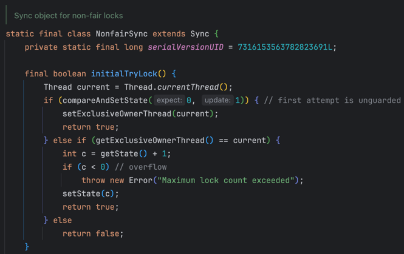
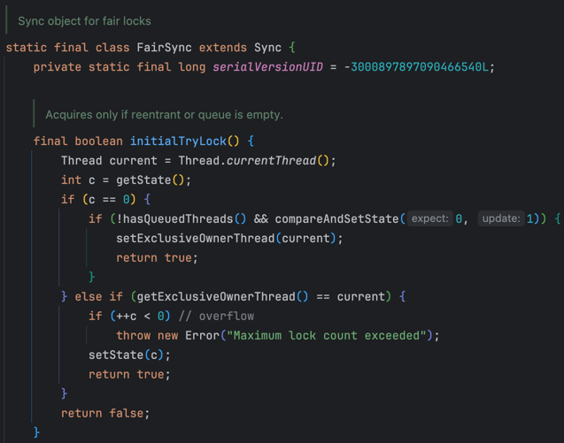
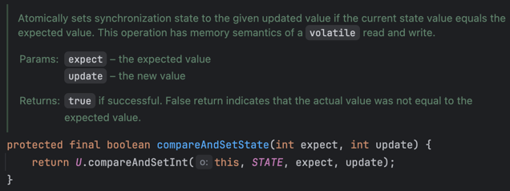

# 동시성 제어 방식에 대한 분석

## 1. 동시성 문제란?

동시성 문제는 concurrent하게 동작하는 여러 task가 동시에 공유자원을 접근할 때 발생합니다. 

예를 들어, 공유자원 int count = 0이 있고, 스레드 A와 스레드 B가 각각 count에 10을 더하는 작업을 수행한다고 가정해보겠습니다.

```java
public class Counter {
    private int counter = 0;

    public void increment() {
        counter = counter + 10;
    }
}
```

스레드 A와 스레드 B가 increment()를 호출하면, 각각 +10씩 이루어지기 때문에 +20을 기대합니다.
그러나 만약 스레드 A와 스레드 B가 동시에 increment()를 호출해서 읽은 counter의 값이 모두 0이라면, 결과가 +10이 됩니다.
즉, 멀티스레드 환경에서 기대하는 결과가 나오지 않는 것이 동시성 문제입니다.

## 2. 동시성 제어 방식

동시성 제어란, 멀티스레드 환경에서도 원하는(기대하는) 결과를 보장하는 것을 의미합니다. 
그러면 동시성 제어 방식에 어떤 것들이 있는지 살펴보겠습니다.

### 2.1 synchronized

synchronized는 블록, 메소드, 클래스 단위로 동기화를 적용할 수 있습니다. 특정 코드 블록 -> 인스턴스 메소드 -> 정적 메소드 수준으로 점차 범위가 증가합니다.

```java
// 1. 코드 블록 동기화 (블록 수준)
public void increment() {
    // logic 1...
	synchronized (this) {
  		counter++;
  	}
  	// logic 2...
}
  
// 2. 메서드 동기화 (메소드 수준)
private int counter = 0;
public synchronized void increment() {
	counter++;
}
  
// 3. 정적 메서드 동기화 (클래스 수준)
private static int counter = 0;
public static synchronized void increment() {
	counter++;
}
```

synchronized는 블록 전체에 락(Monitor Lock)을 걸고 다른 스레드가 접근하면 blocking되는 방식이므로, 스레드가 많을 수록 **성능이 크게 떨어집니다.**
1,000개의 스레드가 동시에 실행되다가 synchronized 블록에 진입하면, 999개의 스레드는 대기하게 되는 거니까요.

### 2.2 ReentrantLock

Lock 인터페이스 구현체 중 하나로 코드 상으로 유연하게 Lock을 사용할 수 있습니다.
AbstractQueuedSynchronizer(AQS)로 구현되어 있고, ReentrantLock의 fairness 여부에 따라 "Fair mode"과 "NonFair mode"으로 나뉩니다.

- AQS란?
  - FIFO 대기 큐를 통해 스레드가 큐에서 대기하고, state 값을 통해 락을 획득한 횟수를 나타냅니다.
    - 대기 큐: CLH Node (이중 연결 리스트)
  - CountDownLatch, ReentrantLock, Semaphore 들이 모두 AQS를 기반으로 구현되어 있습니다.
  - 각 동기화 방식에 맞게 AQS를 상속받아 구현되어 있습니다. 
  - ReentrantLock에서는 state가 1 이상이면, 나머지는 모두 대기합니다. (단, 하나의 스레드가 락을 획득한 상태)
  - Semaphore에서는 state가 일정 임계값 S 이상이면, 나머지는 모두 대기합니다. (S개의 스레드가 락을 획득한 상태)

- ReentrantLock의 fairness에 따른 차이
  - NonFairSync
    - 락이 비어있으면서 내가 가장 먼저 접근했다면 락을 획득합니다.
    - `compareAndSetState(0, 1)`: CAS 알고리즘
    - 
  - FairSync:
    - 대기 스레드가 없고, 락이 비어있으면서 내가 가장 먼저 접근했다면 락을 획득합니다.
    - `!hasQueuedThreads() && compareAndSetState(0, 1)`
    - 


#### CAS 알고리즘이란?
Compare And Swap의 약자로, 기존 값과 변경할 값을 compare해서 같으면 swap하고, 아니면 다시 시도하는 방식입니다.
- expect: 기존 값 (0) / update: 변경할 값 (1)
- state를 0 -> 1로 변경하려고 하는데, (락을 획득하려는 시도)
- 이때, expect와 state가 같으면 true를 반환하고 1로 업데이트합니다. (락 획득 성공)
- 만약, expect와 state가 다르면 false를 반환하고 다시 시도합니다. (락 획득 실패 & 재시도)
- 즉, 락을 기다리는게 아닌, 무한루프를 통해 Nonblocking 하게 재시도를 하는 과정입니다.
- 이때, CAS 연산은 원자성을 보장합니다. (동시에 값을 바꾸려 할 때, 다른 스레드가 중간 과정의 값을 읽어가서 동시성 문제가 발생하지 않도록 하는 것)
- 

#### 위 연산이 volatile과 관련되어 있는 이유
- volatile 키워드를 사용하면, 변수의 값을 읽고 쓸때 CPU 캐시가 아닌 메인 메모리에서 읽어옵니다.
- 즉, 다른 스레드가 값을 변경하면, 메인 메모리에 반영되어 다른 스레드가 최신화된 값을 읽을 수 있습니다.
- 이때, volatile은 가시성을 보장합니다. (다른 스레드가 변경한 값을 즉시 반영)

=> 따라서, ReentrantLock(AQS)는 CAS 연산을 통해 원자성을 보장하고, volatile 키워드를 통해 가시성을 보장합니다.


# 참고
[ReentrantLock이 동작하는 원리(AbstractQueuedSynchronizer)](https://miiiinju.tistory.com/27)